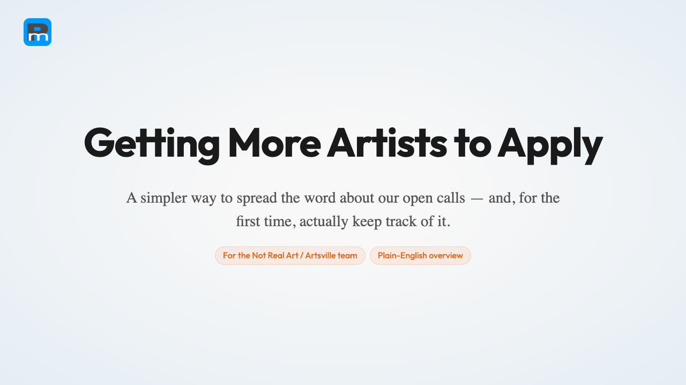

# PolyWiz Exhibit Promo Tool — Concept

**Status:** 🟡 Concept / pre-build — gathering background and shaping the problem. **No code yet, and we are not ready to build anything.**
**Brands:** Not Real Art · Artsville USA · Arterial (Crewest Studio)
**Owner (concept):** Juergen Berkessel (Polymash)
**Graduated from:** [`ideas-inbox` → Idea 011 "Owned Promotion & PR Engine"](https://github.com/JuergenB/ideas-inbox/tree/main/ideas/011-pressranger-outreach-playbook)

<p>
  <a href="https://juergenb.github.io/polywiz-exhibit-promo-tool/exports/exhibit-promo-tool-stakeholders-light.html">
    
  </a>
</p>

There are **two decks** — same project, two audiences:

**🎬 Plain-English overview** — *for the team & board; start here, no jargon:* [open full-screen →](https://juergenb.github.io/polywiz-exhibit-promo-tool/exports/exhibit-promo-tool-stakeholders-light.html) · [dark](https://juergenb.github.io/polywiz-exhibit-promo-tool/exports/exhibit-promo-tool-stakeholders.html) · [PDF](exports/exhibit-promo-tool-stakeholders.pdf)
**🛠 Working deck** — *technical, with the architecture & decisions:* [open full-screen →](https://juergenb.github.io/polywiz-exhibit-promo-tool/exports/exhibit-promo-tool-light.html) · [dark](https://juergenb.github.io/polywiz-exhibit-promo-tool/exports/exhibit-promo-tool.html) · [PDF](exports/exhibit-promo-tool.pdf)
**📄 Sources & references:** [research/README.md](research/README.md) — per-claim sources + confidence flags in [research/05](research/05-pressranger-deep-dive.md) & [research/06](research/06-build-vs-integrate-and-oss-landscape.md).

---

## What this is

A home for designing a tool that does the thing we currently *don't* do well: **promote our open calls and exhibitions so more artists submit** — repeatably, measurably, and the same way every time, instead of "whoever has time."

We are very good at *running* open calls and exhibitions. We have almost no system for *promoting* them. This project exists to close that gap by extending the engine we already own (**PolyWiz**) rather than renting a PR platform.

This repo currently holds **background research and education only**. The use cases, user-centric task flows, the PressRanger / press-release integration design, and the per-exhibition promotion checklist will be added as the concept matures (see [`concept/`](concept/)).

## Why it's its own repo

This concept was incubated as Idea 011 in the [ideas-inbox](https://github.com/JuergenB/ideas-inbox). The inbox's job is to *capture → research → evaluate → graduate*. Idea 011 reached **"Recommend Pilot,"** so it graduates here into its own project to be designed properly. The original idea folder remains the historical record; this repo is where the concept gets built out.

## Where to start reading

| If you want… | Read |
|---|---|
| **Why we're doing this at all** (the education piece) | [research/01-why-promote-open-calls.md](research/01-why-promote-open-calls.md) |
| The situation, the three gaps, the origin story | [research/02-background-and-context.md](research/02-background-and-context.md) |
| How this relates to PolyWiz, Artwork Archive, PressRanger & the ideas-inbox | [research/03-related-systems.md](research/03-related-systems.md) |
| The 66 verified places to promote calls + find funding | [research/04-channel-directory.md](research/04-channel-directory.md) |
| **What PressRanger is** + can we integrate it (no API — CSV only) | [research/05-pressranger-deep-dive.md](research/05-pressranger-deep-dive.md) |
| **Build our own vs. integrate** — the OSS landscape | [research/06-build-vs-integrate-and-oss-landscape.md](research/06-build-vs-integrate-and-oss-landscape.md) |
| **The decisions before we design** (host app, multi-brand, white-label) | [concept/00-key-decisions.md](concept/00-key-decisions.md) |
| What's coming next (use cases, tasks, checklist, integrations) | [concept/README.md](concept/README.md) |

## Repo layout

```
polywiz-exhibit-promo-tool/
├── README.md                       ← you are here
├── research/                       ← background research & education (this phase)
│   ├── 01-why-promote-open-calls.md      the "why" — the core education piece
│   ├── 02-background-and-context.md       the situation, the gaps, the origin
│   ├── 03-related-systems.md              PolyWiz · Artwork Archive · PressRanger · ideas-inbox
│   ├── 04-channel-directory.md            guide to the 66-channel master resource
│   ├── arts-master-resource.csv           the verified data (Airtable-import-ready)
│   └── source-materials/                  original export bundle (deck, widget, brief)
└── concept/                        ← design work (to be added with the user)
    └── README.md                         placeholders: use cases, tasks, integrations, checklist
```

## The one-paragraph version

We already own most of a promotion engine. **PolyWiz** turns a URL into AI-drafted content, runs it through an approval queue, and publishes on a tapering schedule across 14 platforms — and it already has a *scaffolded-but-disabled* "Open Call" campaign type. The plan is to enable that, add a press-release output format and a small paid-social "Open Calls" category, register every call across the free listing boards artists actually use, and plug **PressRanger** in as one cheap, already-owned journalist-database feed. Own the engine; rent only the commodity inputs. The result: every open call gets promoted on a real cadence, pointed at one aligned landing page with UTMs, so for the first time we can measure **cost-per-submission**.
